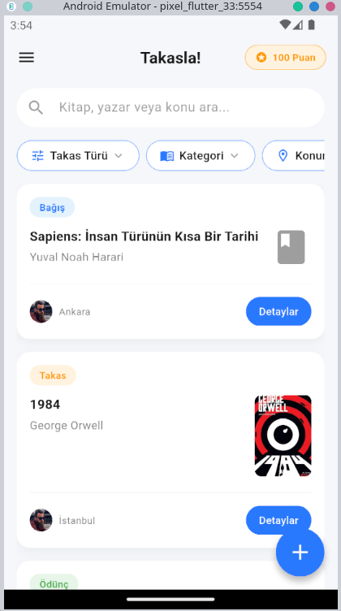
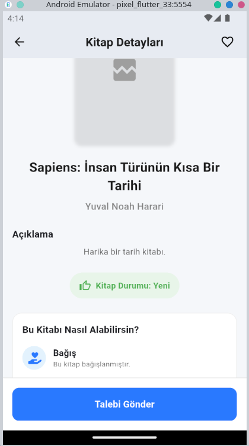
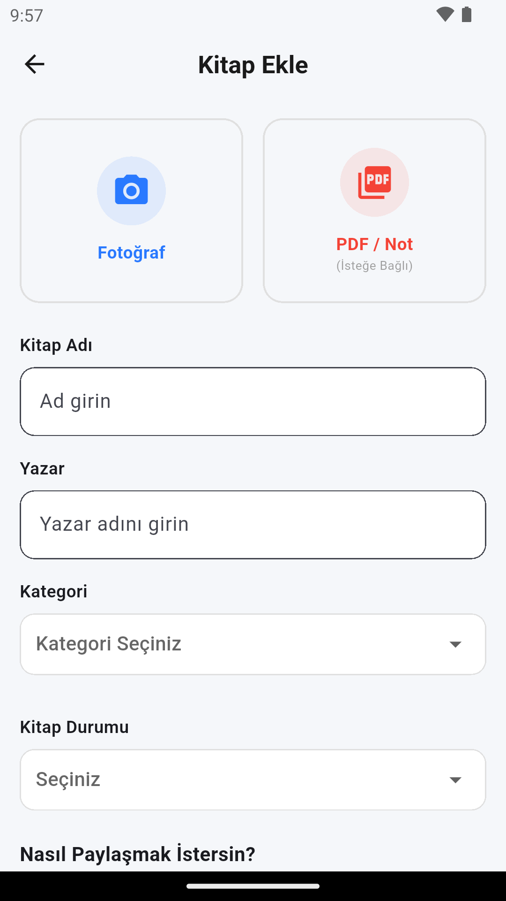
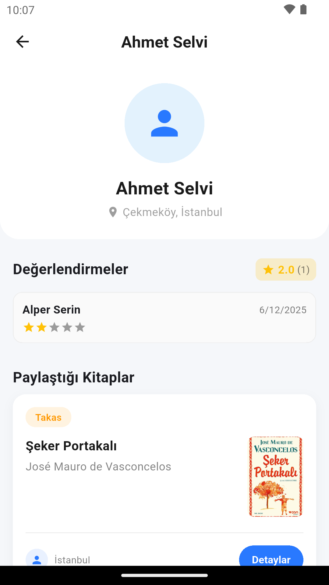

# 📚 Takasla! (Swap It!)

**Takasla!**, öğrencilerin ve kitap severlerin ellerindeki fiziksel kitapları veya dijital ders notlarını (PDF) güvenli bir şekilde takas etmelerini, bağışlamalarını veya ödünç vermelerini sağlayan, yapay zeka destekli bir mobil platformdur.

<p align="center">
  
</p>

<p align="center">
  
  
  
</p>

---

## 🎯 Projenin Amacı

Artan kitap maliyetlerine karşı öğrencilere sürdürülebilir bir çözüm sunmak amacıyla geliştirilmiştir.  
**Takasla!**, sadece bir ilan panosu olmanın ötesinde;

- 🛡️ Güvenli Teslimat  
- 🤖 Yapay Zeka İçerik Denetimi  
- ⭐ Kullanıcı Puanlama Sistemi  

ile güvenilir bir **“Kitap Kardeşliği”** ekosistemi oluşturmayı hedefler.

> *Bu proje, Mobil Programlama dersi kapsamında geliştirilmeye başlanmış ve uçtan uca çalışan bir ürüne dönüştürülmüştür.*

---

## ✨ Temel Özellikler

### 🔄 Takas, Bağış ve Ödünç Modülleri
Kullanıcılar kitaplarını satmak yerine **takas edebilir**, ücretsiz **bağışlayabilir** veya belirli bir süreliğine **ödünç verebilir**.

---

### 🤖 Google Gemini AI ile PDF Analizi
Uygulamaya yüklenen ders notları (PDF), **Google Gemini Yapay Zekası** tarafından analiz edilir.

- İçeriğin ders notu formatına uygunluğu
- Okunabilirlik
- Zararlı veya uygunsuz içerik kontrolü

otomatik olarak gerçekleştirilir.

---

### 🛡️ Güvenli Teslimat Sistemi (Çift Taraflı Onay)

Dolandırıcılığı önlemek ve güven ortamı oluşturmak için işlem süreci şu şekilde ilerler:

1. Alıcı ürünü aldığında **“Teslim Aldım”** onayı verir.
2. Satıcı ürünü verdiğinde **“Teslim Ettim”** onayı verir.
3. Her iki taraf onaylamadan işlem tamamlanmaz.
4. Sorun yaşanırsa **“Uyuşmazlık Bildir”** butonu aktif olur.

---

### 📍 Konum Bazlı İlanlar
`Geolocator` servisi sayesinde kullanıcılar:

- Kendilerine en yakın ilanları
- Mesafe bilgisiyle birlikte

görüntüleyebilir.

---

### ⭐ İtibar Sistemi (Reputation System)
Her işlem sonrası kullanıcılar:

- Karşı tarafı puanlayabilir
- Yorum bırakabilir

Böylece güvenilir kullanıcılar **profil rozetleriyle** öne çıkar.

---

## 🛠️ Kullanılan Teknolojiler ve Mimari

Proje, **Clean Architecture** prensiplerine uygun olarak geliştirilmiştir.

| Teknoloji | Kullanım Amacı |
|---------|---------------|
| **Flutter & Dart** | Cross-platform mobil uygulama |
| **BLoC / Cubit** | State Management |
| **Firebase Auth** | Kullanıcı kimlik doğrulama |
| **Cloud Firestore** | Gerçek zamanlı NoSQL veritabanı |
| **Firebase Storage** | Görsel ve PDF depolama |
| **Google Gemini API** | PDF analiz & moderasyon |
| **Geolocator** | Konum ve mesafe hesaplama |

---

## 📱 Ekran Görüntüleri

| Ana Sayfa | Kitap Detay | Kitap Ekleme | Profil |
|:--:|:--:|:--:|:--:|
|  |  |  |  |

---

## 🚀 Kurulum ve Çalıştırma

### 1 Projeyi Klonlayın
```bash
git clone https://github.com/alpsei/takasla-app.git
cd takasla
```
### 2 Bağımlılıkları Yükleyin
```bash
flutter pub get
```

### 3. Firebase Kurulumu
- Kendi Firebase Projenizi Oluşturun
```text
google-services.json
``` 
(Android) ve 
```text
GoogleService-Info.plist
``` 
(IOS) dosyalarınızı ilgili klasörlere ekleyin.

### 4. API Anahtarları
- '''text
.env
'''
dosyanızı oluşturun ve Google Gemini API anahtarınızı ekleyin:
```bash
GEMINI_API_KEY=API_ANAHTARINIZ
```

### 5. Çalıştırın
```bash
flutter run
```

### 🤝 Katkıda Bulunma
Bu proje açık kaynaklıdır ve geliştirmelere açıktır. Katkıda bulunmak isterseniz:
- Forklayın
- Yeni bir dal (branch) oluşturun (git checkout -b ozellik/YeniOzellik)
- Değişikliklerinizi commitleyin
- Dalınızı pushlayın
- Bir Pull Request oluşturun.

### 📞 İletişim
- Geliştirici: Alper Serin
- Linkedin: https://www.linkedin.com/in/alper-serin/
- E-Posta: alpersrn06@gmail.com
